# UI/UX — Mapa de Pantallas

> ⚠️ Este archivo se auto-carga al inicio de cada sesión (vía `@context/UI-UX.md` en `CLAUDE.md`).
> Contiene el mapa de pantallas reales de la aplicación para que el agente redacte Test Cases sin suponer labels, rutas ni comportamientos.

**Cómo se llena:** usa el skill `project-onboarding` — adjunta screenshots de las pantallas y el agente generará una entrada por cada una, guardando la imagen en `context/screenshots/`.

**Regla para el agente:** antes de redactar steps de un TC sobre una pantalla, busca su entrada aquí. Si no existe, NO supongas el diseño — pide un screenshot al usuario o inspecciona la app real vía MCP Browser antes de escribir el TC.

---

## Formato de cada entrada

Copia este bloque por cada pantalla nueva:

```markdown
## [Portal] > [Módulo] > [Nombre de pantalla]
- **Ruta/URL:** ...
- **Cómo se llega aquí:** [pantalla origen + acción/botón exacto]
- **Elementos clave:**
  | Elemento | Tipo | Texto/label literal | Comportamiento |
  |---|---|---|---|
  | ... | botón | "Guardar" | abre modal de confirmación |
- **Estados:** vacío / con datos / error / loading
- **Screenshot:** 
- **Notas para TCs:** [detalles relevantes]
---
```

---

## Pantallas documentadas

## Autoreg / PDV (sistema externo) > Login federado
- **Ruta/URL:** `https://testwaf.portaldevehiculos.com/Forms/Account/LoginNew.aspx` (ambiente Test)
- **Cómo se llega aquí:** acceso directo a la URL — es el punto de entrada real para autenticarse antes de llegar a Motorambar.
- **Elementos clave:**
  | Elemento | Tipo | Texto/label literal | Comportamiento |
  |---|---|---|---|
  | Logo | texto/ícono | "portaldevehiculos" | esquina superior del card de login |
  | Barra de color | decorativo | — | franja de colores bajo el logo |
  | Campo | input | "Usuario" | ícono de usuario |
  | Campo | input | "Contraseña" | ícono de candado |
  | Link | link | "¿Olvidó su Contraseña?" | — |
  | Botón | primario naranja | "INICIAR SESIÓN" | autentica y redirige al landing de PDV ("Bienvenido") |
  | Botón secundario | botón | _(texto no legible en la captura — pendiente confirmar)_ | debajo de "INICIAR SESIÓN" |
  | Footer | texto | "Política de Privacidad" + copyright | — |
- **Estados:** solo documentado el estado vacío/inicial (sin credenciales). Error de credenciales — no documentado.
- **Screenshot:** 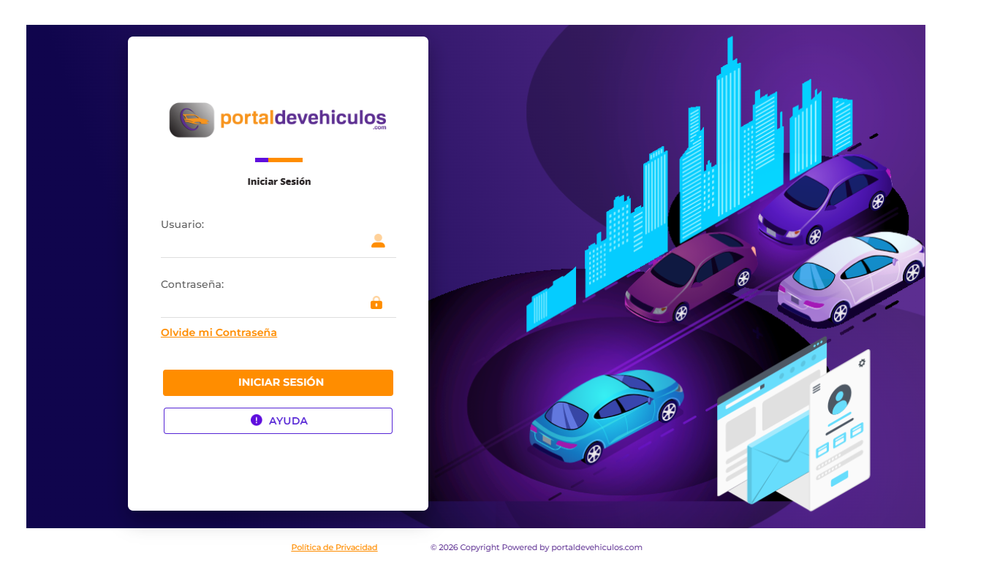
- **Notas para TCs:** este es el login REAL del ambiente de Test — un TC de login E2E debe iniciar aquí (no en `/login` de Motorambar, que es solo para desarrollo). Tras "INICIAR SESIÓN" exitoso, el flujo llega al landing de PDV (ver entrada siguiente) y desde ahí, al botón "Portal Distribuidor", que redirige a Motorambar.
---

## Autoreg / PDV (sistema externo) > Bienvenido (landing post-login)
- **Ruta/URL:** _(pendiente — mismo dominio `portaldevehiculos.com`, ruta exacta no confirmada)_
- **Cómo se llega aquí:** tras "INICIAR SESIÓN" exitoso en el login federado de Autoreg.
- **Elementos clave:**
  | Elemento | Tipo | Texto/label literal | Comportamiento |
  |---|---|---|---|
  | Logo | texto/ícono | "DISTO — directoria de servicios al conductor" | esquina superior izquierda |
  | Barra superior | info | "Usuario: {username}" / "Rol: {ROL_PDV}" / "Fecha: {dd-mmm-aaaa}" | ej. "Usuario: jovidio · Rol: CASE LOCATION SUPERVISOR" — el rol mostrado aquí es el **rol en PDV**, distinto del rol "Cliente"/"Distribuidor" que el mismo usuario tiene en Motorambar |
  | Link | link | "Perfil de Seguridad" | esquina superior derecha |
  | Botón | botón (ícono logout) | "Salida" | esquina superior derecha |
  | Título | texto | "Inicio: Bienvenido" | — |
  | Balance | texto naranja | "Balance: $XXX,XXX.XX" | + íconos casa/lupa |
  | Logo | texto/ícono | "portaldevehiculos.com" | logo principal del portal |
  | Dropdown | botón | "Opciones ▼" | — |
  | Sección | grupo de botones | "Consultas" | "Consulta Vehículo", "Consulta Persona", "Consulta Pre Venta" |
  | Sección | grupo de botones | "Registros" | "Registro de Autos en Lote", "Traspaso de Autos en Lote", "Pre Venta en Lote", "Pagos en Lote" |
  | Sección | grupo de botones | "Multas" | "Pagar Multas", "Pagar Multas Batch" |
  | Sección | grupo de botones | "Datos y Documentos" | "Documentos en Lote", "Integración Datos y Documentos", "Procesamiento Preventas Excel", **"Portal Distribuidor"** |
  | Botón | botón, sección "Datos y Documentos" | "Portal Distribuidor" | **redirige a Motorambar/VehicleDocs** (`https://motorambartest.portaldevehiculos.com/`) vía SSO |
  | Sección | grupo de botones | "Solicitud 770" | "Presentación de Gravamen", "Refinanciamiento", "Liberación de Gravamen", "Ley 253" |
- **Estados:** con datos (visto con usuario `jovidio`, Rol PDV "CASE LOCATION SUPERVISOR"). Para `distri2` u otros roles, los botones/secciones visibles podrían variar — no confirmado.
- **Screenshot:** 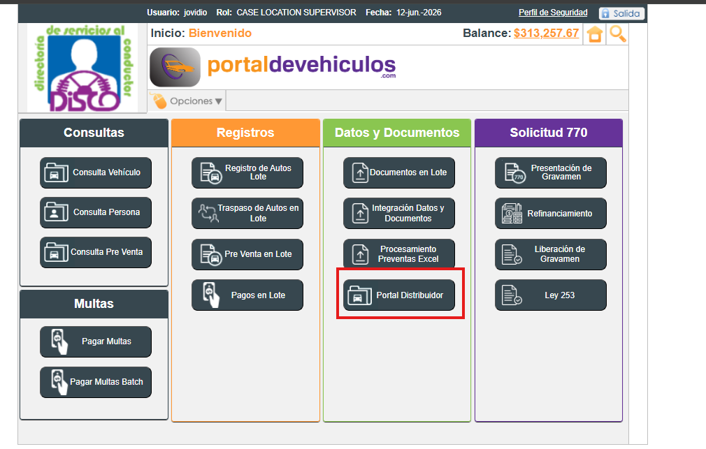
- **Notas para TCs:** el botón **"Portal Distribuidor"** (sección "Datos y Documentos") es el paso final del flujo SSO hacia Motorambar — un TC de login E2E completo debe incluir: login en Autoreg → (cerrar modal "Términos y Condiciones" si aparece) → clic en "Portal Distribuidor" → llegar al Dashboard de Motorambar.

### Componente: Modal "Terminos y Condiciones" (condicional, primera sesión)
| Elemento | Tipo | Texto/label literal | Comportamiento |
|---|---|---|---|
| Título | texto | "Terminos y Condiciones" | — |
| Lista de cláusulas | checkboxes | 4 párrafos de términos legales (texto firmado "Yo, {NOMBRE}, certifico/reconozco/acepto...") | las 3 primeras vienen pre-marcadas; la 4ª (sobre el procesador de pago del Depto. de Hacienda) viene **sin marcar** |
| Botón | primario | "Continuar" | cierra el modal y continúa al landing "Bienvenido" |

Screenshot: 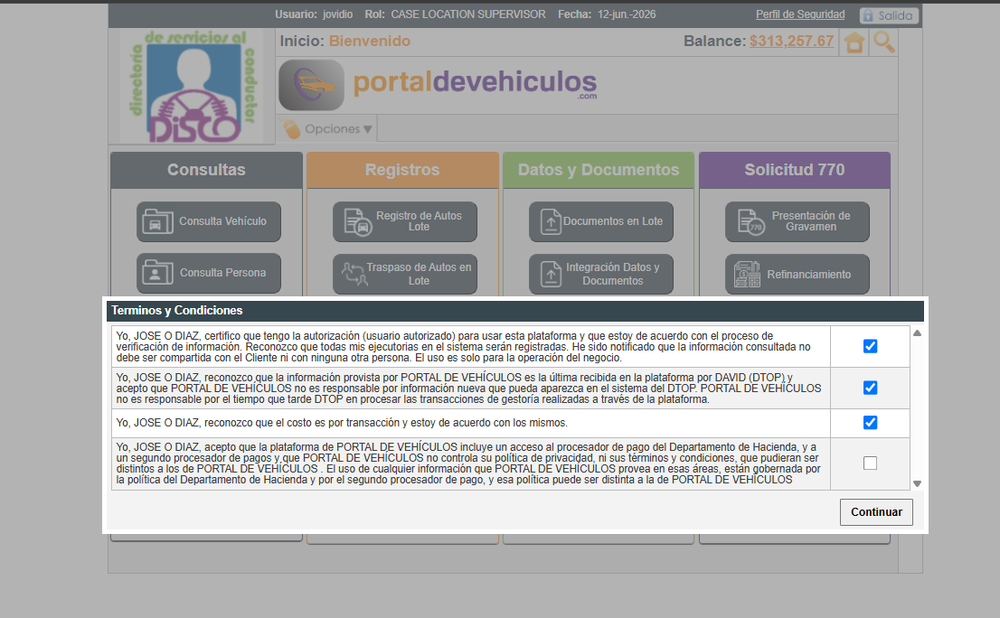

**Notas para TCs:** este modal es **condicional** — solo aparece en la primera sesión/login del usuario. Para un TC de login, documentar ambos casos: con modal (primera vez) y sin modal (sesiones posteriores). No asumir que siempre aparece.
---

## Motorambar > Dashboard > Dashboard Ejecutivo
- **Ruta/URL:** `/` (root)
- **Cómo se llega aquí:** Tras un login exitoso (SSO o login interno vía `/auth-test`), o haciendo clic en "Dashboard" en el menú lateral.
- **Elementos clave:**
  | Elemento | Tipo | Texto/label literal | Comportamiento |
  |---|---|---|---|
  | Logo + nombre app | texto/ícono | "VehicleDocs" | esquina superior izquierda, con botón de colapsar sidebar |
  | Badge contexto | badge | "MANUFACTURER" | fijo bajo el logo en el sidebar |
  | Item de menú | nav link | "Dashboard" | activo/resaltado en esta pantalla |
  | Item de menú | nav link | "Vehículos Importados" | badge numérico con el total de vehículos (ej. `1057`); si el total es `0` el badge **desaparece** (no muestra "0"); navega al grid |
  | Ícono notificaciones | botón | (campana con badge "+") | abre dropdown "NOTIFICACIONES" |
  | Ícono ayuda | botón | "?" | — |
  | Perfil usuario | botón/dropdown | nombre de usuario + badge de rol (ej. "DISTRIBUIDOR") + chevron | abre menú de perfil |
  | Título de página | texto | "Dashboard Ejecutivo" | — |
  | Subtítulo | texto | "OPERACIONES EN TIEMPO REAL" | — |
  | Breadcrumb | texto | "DASHBOARD" | — |
  | Botón exportar | botón | "EXPORTAR DATOS" | esquina superior derecha, color morado |
  | Tarjeta KPI 1 | card | "CANTIDAD DE VEHÍCULOS" | valor numérico (ej. `1057`) + badge de variación (ej. `+105400%`) |
  | Tarjeta KPI 2 | card | "CANT. CO GENERADOS HOY" | valor (ej. `7`) + badge variación (ej. `+600%`) |
  | Tarjeta KPI 3 | card | "CANTIDAD DE CO GENERADOS" | valor (ej. `9`) + badge variación (`0%`) |
  | Tarjeta KPI 4 | card | "CANT. VEHÍCULOS ENVIADOS A PDV" | valor (ej. `389`) + badge variación |
  | Tarjeta KPI 5 | card | "CANT. VEHÍCULOS PENDIENTE DE ENVÍO A PDV" | valor (ej. `668`) + badge variación |
  | Tarjeta KPI 6 | card | `DASHBOARD.[PENDING TO DEFINE]` | ⚠️ key de traducción **sin traducir**, visible literalmente en UI; valor `0` |
  | Gráfico de barras | chart | "VEHÍCULOS POR MARCA POR MES" | leyenda por marca (ej. Infiniti, Kia, Nissan); link "Descargar Excel" |
  | Gráfico de líneas | chart | "CO GENERADOS ÚLTIMOS 6 MESES" | eje X meses (Ene-Jun); link "Descargar Excel" |
  | Gráfico donut | chart | "DISTRIBUCIÓN DE CO POR ESTADO" | leyenda "Anulados" (rojo) / "Generados" (verde) / "Pendientes" (morado); link "Descargar Excel" |
  | Footer | texto | "© 2026 VehicleDocs" | — |
- **Estados:**
  - Con datos (visto).
  - **Vacío:** todas las tarjetas KPI muestran `0`.
  - **Loading:** la pantalla se ve vacía (sin contenido ni skeleton visible) hasta que la data está disponible.
  - Error — no documentado.
- **Screenshot:** 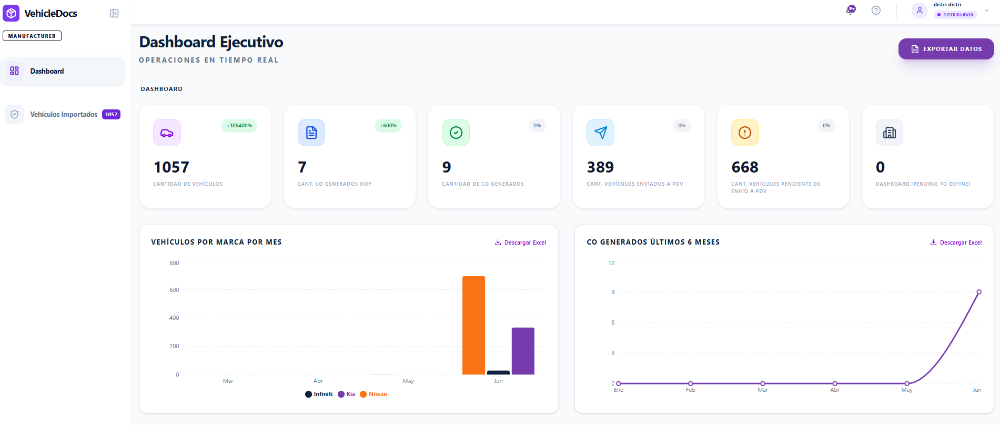 · 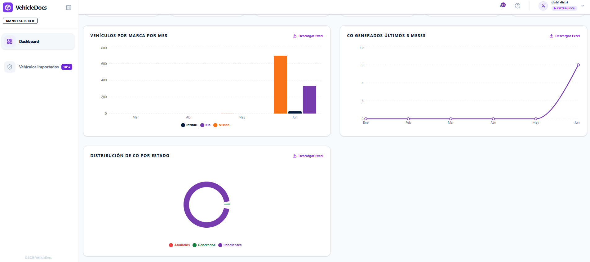
- **Notas para TCs:**
  - La 6ª tarjeta KPI muestra literalmente la key de i18n `DASHBOARD.[PENDING TO DEFINE]` sin traducir — si un TC valida el contenido de esta tarjeta, documentar el comportamiento actual (texto crudo) como hallazgo, no asumir que cambiará.
  - Los enlaces "Descargar Excel" de cada gráfico son acciones independientes — no asumir un único botón de exportación global (ese es "EXPORTAR DATOS").
---

## Motorambar > Vehículos Importados > Grid de inventario
- **Ruta/URL:** `/import`
- **Cómo se llega aquí:** clic en "Vehículos Importados" en el menú lateral (Dashboard u otra pantalla).
- **Elementos clave:**
  | Elemento | Tipo | Texto/label literal | Comportamiento |
  |---|---|---|---|
  | Título | texto | "Vehículos Importados" | — |
  | Subtítulo | texto | "Historial de Inventario" | — |
  | Botón | dropdown | "Acciones" | abre menú con opción "Importar CPA" (con ícono de documento) → navega a `/import/cpa` |
  | Botón | botón primario | "Generar Reporte" | abre modal "Reporte de Inventario de Vehículos" |
  | Buscador | input | placeholder "Buscar por VIN" | ícono de expandir habilita búsqueda multi-VIN (uno por línea), con contadores "Total" / "Válidos" / "Inválidos" y chips removibles |
  | Filtro de localidades | botón + dropdown | "Todas las Localidades" | ver detalle abajo (popup) |
  | Favoritos | ícono estrella | — | activa/desactiva filtro "solo favoritos" |
  | Filtro | select | "Estado CO: Todos" | — |
  | Filtro | select | "Estado CPA: Todos" | — |
  | Filtro | select | "Estado Factura: Todos" | — |
  | Sección colapsable | toggle | "MÁS FILTROS" | expande/colapsa filtros adicionales |
  | Filtro adicional | select | "RANGO DE FECHA" → "Todo el Tiempo" | opciones: Hoy, Semana Actual, Mes Actual, Últimos 30 Días, Año a la Fecha, Rango personalizado |
  | Filtro adicional | select | "MARCA" → "Todas las Marcas" | — |
  | Filtro adicional | input | "N.° FACTURA" → "Buscar por no. de factura..." | — |
  | Filtro adicional | input | "N.° CARTA DE CRÉDITO" → "Buscar por no. de carta de crédito..." | — |
  | Filtro adicional | input | "N.° ORDEN DE VENTA" → "Buscar por no. de orden de venta..." | — |
  | Tabla | grid | columnas: checkbox, VIN, VEHÍCULO, ASIGNADO A, FACTURA, PRECIO DE VENTA, ESTADO CO, ESTADO CPA, ESTADO DE FACTURA, PDV-DATOS, PDV-DOCUMENTOS, ACCIONES | cada fila tiene chevron para expandir detalle inline |
  | Badge de estado | badge | "PENDIENTE" (naranja) | aparece en columnas ESTADO CO / ESTADO CPA / ESTADO DE FACTURA |
  | Indicador PDV | ícono | ✓ verde / ✕ rojo (circulares) | estado de sincronización de Datos/Documentos a PDV |
  | Acciones por fila | íconos | ojo (ver), descarga, "añadir documento", "..." (más opciones) | ver detalle abajo |
- **Estados:**
  - Con datos (1057 registros).
  - **Vacío:** la tabla aparece sin filas (ej. un filtro/búsqueda sin resultados); el badge del total en el menú "Vehículos Importados" desaparece (ver Dashboard).
  - **Loading:** toda la pantalla (buscador, filtros, tabla y paginación) se muestra como **skeleton** (placeholders grises) hasta que la data carga.
  - Error — no documentado.
- **Screenshot:** 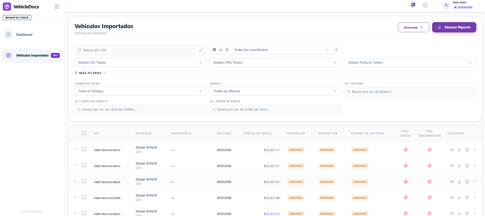 · 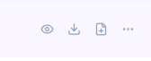 · 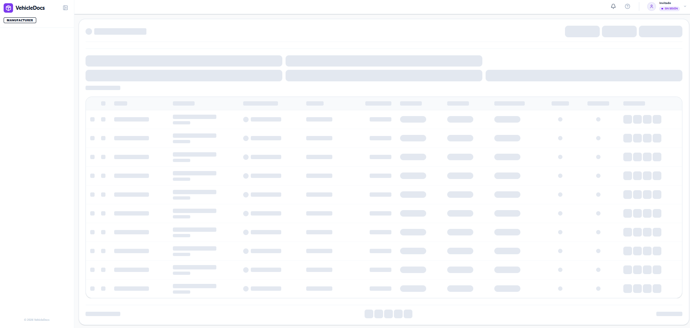

### Componentes / popups asociados a esta pantalla

**Filtro de localidades** (clic en "Todas las Localidades")
| Elemento | Tipo | Texto/label literal | Comportamiento |
|---|---|---|---|
| Toggle | ícono grid | — | filtra "Todas las Localidades" |
| Toggle | ícono carrito | — | filtra por **Dealer** |
| Toggle | ícono casita | — | filtra por **Banco** |
| Estrella | ícono | — | filtra solo localidades marcadas como favorito |
| Buscador | input | "Buscar cliente..." | — |
| Lista | items | "Todas las Localidades" (✓ activo), "AUTOCOREANA PR LLC" ★, "POPULAR AUTO" ★, "ADRIEL KIA", "ADRIEL NISSAN CAGUAS", "ADRIEL NISSAN TOA BAJA" | ítems con ícono carrito = Dealer, ícono casita = Banco; ⭐ amarilla = favorito |

Screenshot: 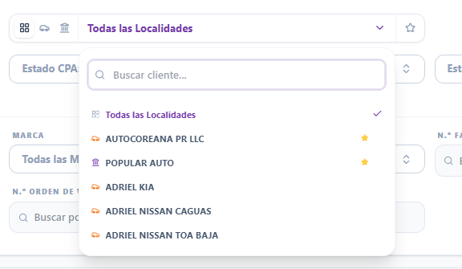

**Menú "Acciones"** (botón "Acciones")
| Elemento | Tipo | Texto/label literal | Comportamiento |
|---|---|---|---|
| Opción de menú | item | "Importar CPA" (ícono documento) | navega a `/import/cpa` |

Screenshot: 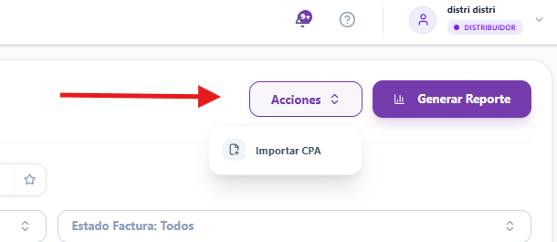

**Menú "..." por fila / barra de acciones batch**
| Elemento | Tipo | Texto/label literal | Comportamiento |
|---|---|---|---|
| Opción de menú (fila) | item | "Agregar documento adicional" | abre modal "Añadir Documento" |
| Opción de menú (fila) | item | "Editar Vehículo" | navega a `/vehicle/[id]` en modo edición |
| Opción de menú (fila) | item | "Asignar A" | abre modal "Asignar Cliente" |
| Opción de menú (fila) | item | "Reenviar Datos a PDV" | — |
| Opción de menú (fila) | item | "Enviar Docs a PDV" | — |
| Opción de menú (fila) | item, rojo | "Eliminar" | abre modal "Eliminar Registros" |
| Barra batch (al seleccionar checkboxes) | toolbar flotante | "{n} VEHÍCULOS SELECCIONADOS" | aparece al pie de la tabla |
| Acción batch | botón | "Descargar ({n})" | abre modal "Descargar Documentos" |
| Acción batch | botón | "Asignar A" | abre modal "Asignar Cliente" |
| Acción batch | botón | "Reenviar Datos a PDV" | — |
| Acción batch | botón | "Enviar Docs a PDV" | — |
| Acción batch | botón, rojo | "Eliminar" | abre modal "Eliminar Registros" |
| Cerrar barra batch | ícono "X" | — | deselecciona todo |

Screenshot: 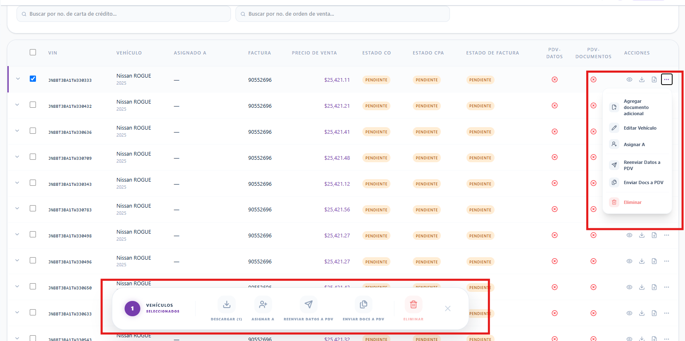

**Modal "Eliminar Registros"**
| Elemento | Tipo | Texto/label literal | Comportamiento |
|---|---|---|---|
| Ícono | basura roja | — | — |
| Título | texto | "Eliminar Registros" | — |
| Subtítulo | texto rojo | "ESTA ACCIÓN NO SE PUEDE DESHACER" | — |
| Cuerpo | texto | "¿Estás seguro que deseas eliminar {n} registros de vehículos seleccionados?" | `{n}` = cantidad seleccionada |
| Botón | secundario | "CANCELAR" | cierra modal sin acción |
| Botón | primario rojo | "ELIMINAR" | confirma eliminación |
| Cerrar | ícono "X" | — | esquina superior derecha |

Screenshot: 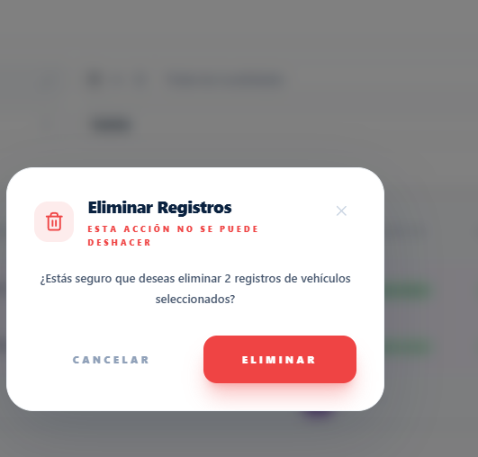

**Modal "Asignar Cliente"**
| Elemento | Tipo | Texto/label literal | Comportamiento |
|---|---|---|---|
| Ícono | persona+ morado | — | — |
| Título | texto | "Asignar Cliente" | — |
| Subtítulo | texto morado | "ACTUALIZANDO {n} VEHÍCULO(S)" | — |
| Label | texto | "SELECCIONAR CLIENTE" | — |
| Toggles | íconos grid/carrito/casita | — | filtran la lista de clientes por Todos/Dealer/Banco |
| Dropdown | select | "Elegir un cliente..." | + ícono estrella (favoritos); ej. "ADRIEL NISSAN CAGUAS" |
| Buscador | input | "Buscar cliente..." | — |
| Lista de clientes | items | "POPULAR AUTO" ★, "FIRSTBANK", "ORIENTAL BANK", "PDV", "TOYOTA CREDIT" | cada uno con ícono casita (Banco) |
| Botón | secundario | "CANCELAR" | cierra modal sin acción |
| Botón | primario morado | "CONFIRMAR" | confirma la asignación del cliente seleccionado |

Screenshot: 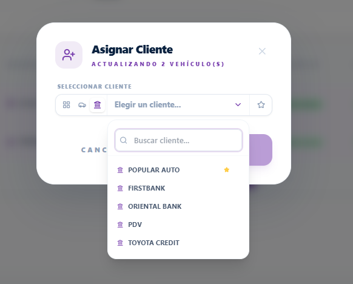 · 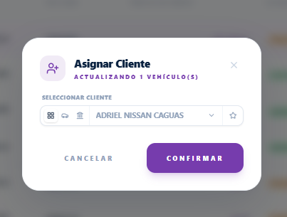

**Menú de descarga individual** (ícono descarga en columna ACCIONES de una fila)
| Elemento | Tipo | Texto/label literal | Comportamiento |
|---|---|---|---|
| Opción | item (habilitado) | "Descargar Todos" | — |
| Opción | item (habilitado) | "Descargar CO" | — |
| Opción | item (habilitado) | "Descargar CPA" | — |
| Opción | item (deshabilitado) | "Descargar Factura" | gris — depende de si existe el documento |
| Opción | item (deshabilitado) | "Descargar Carta Exento de Arbitrios" | gris |
| Opción | item (deshabilitado) | "Descargar Otros" | gris |

Screenshot: 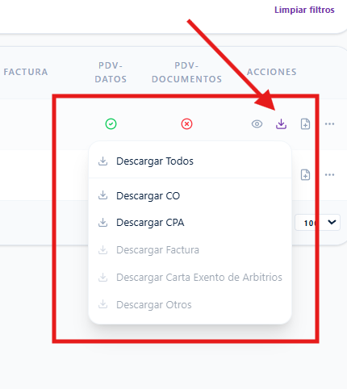

**Modal "Descargar Documentos"** (batch, desde la barra de selección)
| Elemento | Tipo | Texto/label literal | Comportamiento |
|---|---|---|---|
| Ícono | descarga morada | — | — |
| Título | texto | "Descargar Documentos" | — |
| Subtítulo | texto morado | "{n} VEHÍCULOS SELECCIONADOS" | — |
| Checkbox | checkbox | "SELECCIONAR TODOS" | marca/desmarca todas las opciones |
| Checkbox (marcado) | checkbox | "CO" | — |
| Checkbox (marcado) | checkbox | "CPA" | — |
| Checkbox (marcado) | checkbox | "Carta Exento de Arbitrios" | — |
| Checkbox (marcado) | checkbox | "Factura" | — |
| Checkbox (sin marcar) | checkbox | "Otros" | — |
| Botón | secundario | "CANCELAR" | — |
| Botón | primario morado | "DESCARGAR" | — |

Screenshot: 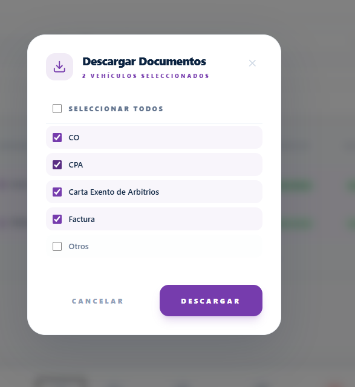

**Modal "Reporte de Inventario de Vehículos"** (botón "Generar Reporte")
| Elemento | Tipo | Texto/label literal | Comportamiento |
|---|---|---|---|
| Ícono | gráfico morado | — | — |
| Título | texto | "Reporte de Inventario de Vehículos" | — |
| Subtítulo | texto | "• {año} • {n} VEHÍCULOS ENCONTRADOS" | — |
| Botón | botón outline | "EXPORTAR PDF" | — |
| Filtro | label | "REFINAMIENTO PRE-EXPORTACIÓN" / "FILTRAR POR PERIODO DE REPORTE" | — |
| Filtro periodo | botones (toggle group) | "TODO" / "HOY" / "SEMANA" / "MES" / "AÑO" | "TODO" activo por defecto (morado) |
| Tarjeta | card | "VALOR TOTAL" | ej. `$27,718,891.25` |
| Tarjeta | card | "PRECIO PROMEDIO" | ej. `$26,224.12` |
| Tarjeta | card | "COS COMPLETADOS" | ej. `15` |
| Tarjeta | card | "FACTURAS EMITIDAS" | ej. `10` |
| Tabla | grid | columnas VIN / MODELO / FECHA DE VENTA / PRECIO | lista de vehículos del periodo filtrado |
| Cerrar | ícono "X" | — | esquina superior derecha |

Screenshot: 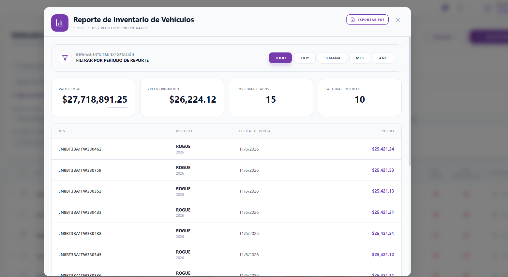

---

## Motorambar > Vehículos Importados > Detalle de vehículo (solo lectura)
- **Ruta/URL:** `/vehicle/[id]` (modo lectura)
- **Cómo se llega aquí:** ícono "ojo" (ver) en la columna ACCIONES de una fila del grid "Vehículos Importados".
- **Elementos clave:**
  | Elemento | Tipo | Texto/label literal | Comportamiento |
  |---|---|---|---|
  | Flecha volver | ícono | "←" | regresa al grid |
  | Título | texto | "Nro. {VIN}" | ej. "Nro. 5XYRL4JC9TG442904" |
  | Subtítulo | texto | "{MARCA} {MODELO} {AÑO}" | ej. "KIA SORENTO 2026" |
  | Botón | outline rojo | "Eliminar" | ícono basura |
  | Botón | outline morado | "Editar" | ícono lápiz; navega a modo edición |
  | Sección "DETALLES" | fieldset | VIN `CO`, MARCA `CO`, MODELO, AÑO `CO`, CLIENTE ASIGNADO | campos de solo lectura; badge `CO` = el dato proviene/está validado contra el Certificado de Origen |
  | Sección "ESPECIFICACIONES TÉCNICAS" | fieldset | COLOR AUTO, PUERTAS, CILINDROS `CO`, CABALLOS DE FUERZA `CO`, TIPO DE PROPULSIÓN, PESO DE VEHÍCULO `CO`, CAPACIDAD DE CARGA `CO`, UNIDAD DE VEHÍCULO, SERIE O MODELO `CO` | — |
  | Sección "REGULATORIO Y ORIGEN" | fieldset | CÓDIGO DE ORIGEN, TIPO DE CARROCERÍA `CO`, NO. TÍTULO, FECHA TÍTULO `CO` | — |
  | Sección "FINANCIERO" | fieldset | PRECIO CONTRIBUTIVO, ARBITRIOS, FECHA DE PAGO DE ARBITRIOS, NRO. DECLARACIÓN DE ARBITRIOS, CPA ID, ID CONTRIBUYENTE, NRO. FACTURA `CO`, CONCESIONARIO `CO`, NRO. DE LICENCIA, ID CLIENTE, NRO. DE ORDEN DE VENTA, NRO. CARTA DE CRÉDITO, INSTITUCIÓN FINANCIERA | — |
  | Sección "CERTIFICADO DE ORIGEN" | card + badge estado | badge "COMPLETADO" (verde); campos CÓDIGO ORIGEN, NO. TITULO, TIPO DE CUERPO, FECHA TITULO; botones "DESCARGAR" / "PREVISUALIZAR" | panel derecho "HISTORIAL DE SEGUIMIENTO" con eventos "CO Generado" / "CO Reemplazado" (fecha + nombre de archivo PDF) |
  | Sección "CONTRATO DE COMPRA (CPA)" | card + badge estado | badge "SUBIDO" (verde); campos PRECIO VENTA, IMPUESTO VENTA, FECHA IMPUESTO, DECLARACIÓN ARB, ID CPA, RNC CONTRIBUYENTE; botones "DESCARGAR" / "PREVISUALIZAR" | panel derecho "HISTORIAL DE SEGUIMIENTO" con evento "CPA Importado" (fecha + nombre de archivo PDF) |
  | Sección "DETALLES DE FACTURACIÓN" | card + badge estado | badge "PENDIENTE" (naranja); estado vacío: ícono subir, "FACTURA FALTANTE" / "No hay factura disponible para este registro." | panel derecho "SEGUIMIENTO FINANCIERO" → "SINCRONIZACIÓN FINANCIERA ACTIVA" / "CONECTADO A {institución financiera}" |
  | Sección "DOCUMENTOS ADICIONALES" | card | (vacío en captura) | — |
- **Estados:** con datos, todas las secciones con badge de estado (COMPLETADO/SUBIDO/PENDIENTE). Vacío total no documentado.
- **Screenshot:** 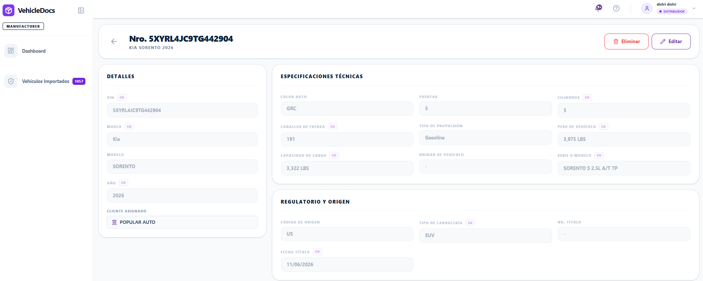 · 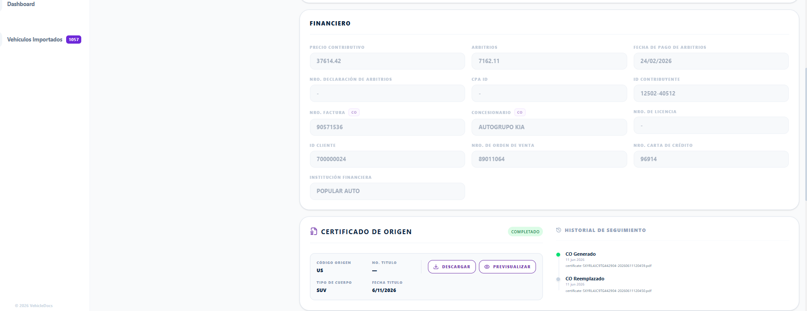 · 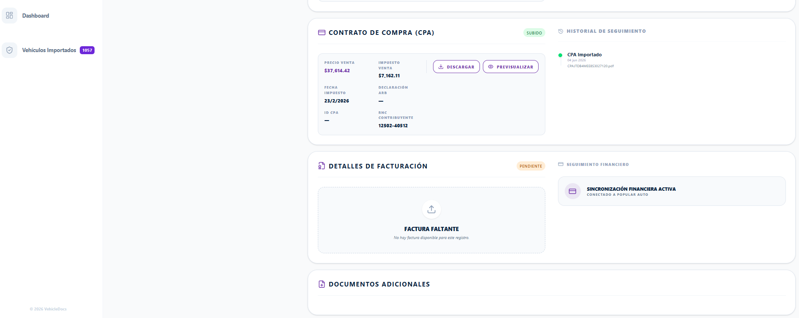
- **Notas para TCs:**
  - El badge `CO` junto a un campo indica que el valor proviene del Certificado de Origen — útil para TCs que validan precarga de datos desde CO.
  - "CPA" en esta pantalla aparece como "CONTRATO DE COMPRA (CPA)"; en el flujo de importación (`/import/cpa`) el mismo término se describe como "Certificados de Pago de Arbitrios" — ambos labels son literales del sistema, no homologar.
---

## Motorambar > Vehículos Importados > Editar vehículo
- **Ruta/URL:** `/vehicle/[id]` (modo edición)
- **Cómo se llega aquí:** botón "Editar" en el detalle de vehículo, o "Editar Vehículo" desde el menú "..." de una fila del grid.
- **Elementos clave:**
  | Elemento | Tipo | Texto/label literal | Comportamiento |
  |---|---|---|---|
  | Título | texto | "Editar Vehiculo: {VIN}" | — |
  | Subtítulo | texto | "{MARCA} {MODELO} {AÑO}" | — |
  | Botón | outline | "Cancelar" | ícono "X"; descarta cambios |
  | Botón | outline morado | "Asignar Cliente" | ícono persona+; abre modal "Asignar Cliente" |
  | Botón | primario morado | "Guardar Cambios" | ícono disco; persiste cambios |
  | Banner cambios sin guardar | alert amarillo | "Cambios sin guardar" / "Has modificado {n} campo(s). No olvides guardar tus cambios." | lista chips con el nombre de cada campo modificado (ej. "PUERTAS") |
  | Campos editables | input/select | mismas secciones "DETALLES", "ESPECIFICACIONES TÉCNICAS", "REGULATORIO Y ORIGEN" que en modo lectura | MARCA, MODELO, COLOR AUTO y TIPO DE PROPULSIÓN son `<select>`; campos numéricos (ej. PUERTAS) tienen spinner +/- |
  | Campo modificado | input resaltado | borde naranja + punto naranja | indica que ese campo difiere del valor original |
  | Sección "CERTIFICADO DE ORIGEN" / "CONTRATO DE COMPRA (CPA)" | card | igual que en solo lectura + botón adicional "REEMPLAZO" (ícono subir) | permite reemplazar el archivo del documento |
  | Sección "DETALLES DE FACTURACIÓN" | card | estado vacío "FACTURA FALTANTE" + botón "IMPORTAR FACTURA" (morado, ícono subir) | botón solo visible en modo edición |
  | Sección "DOCUMENTOS ADICIONALES" | card | link "+ AGREGAR DOCUMENTO" (arriba a la derecha) + dropzone "SUBIR NUEVO" | abre modal "Añadir Documento" |
- **Estados:** sin cambios / con campo(s) modificado(s) (banner amarillo + chip por campo).
- **Screenshot:** 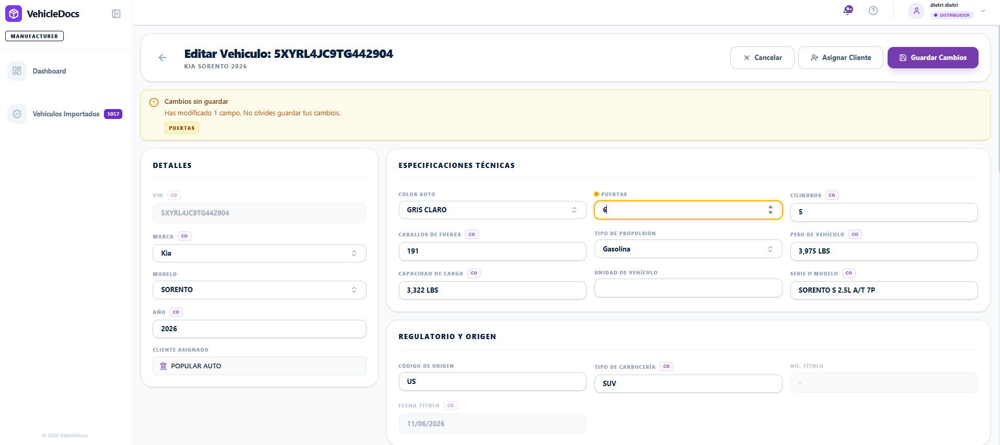 · 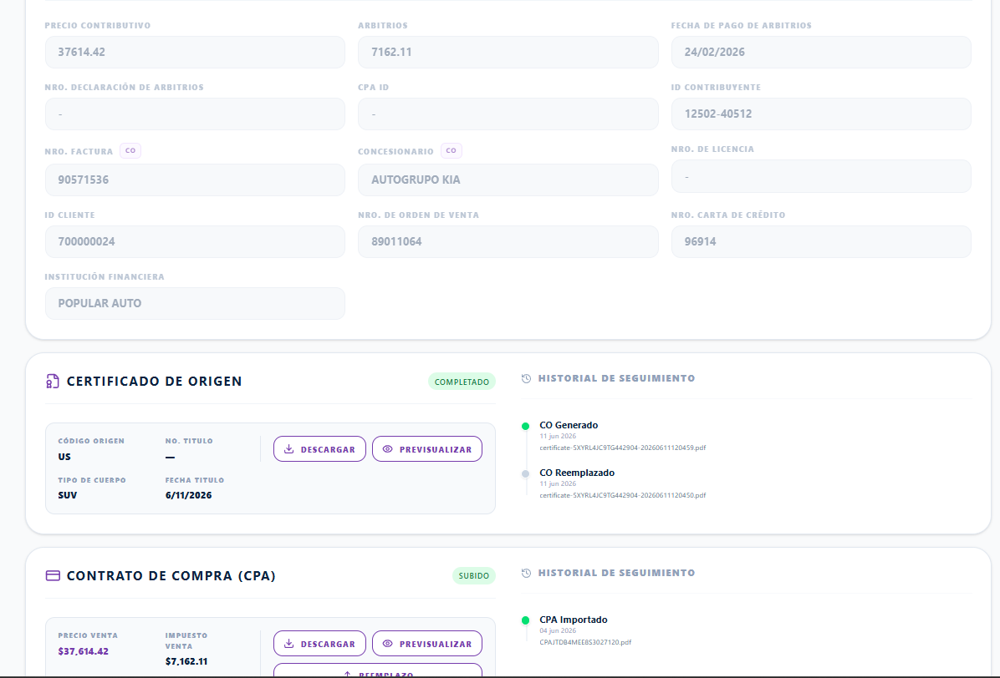 · 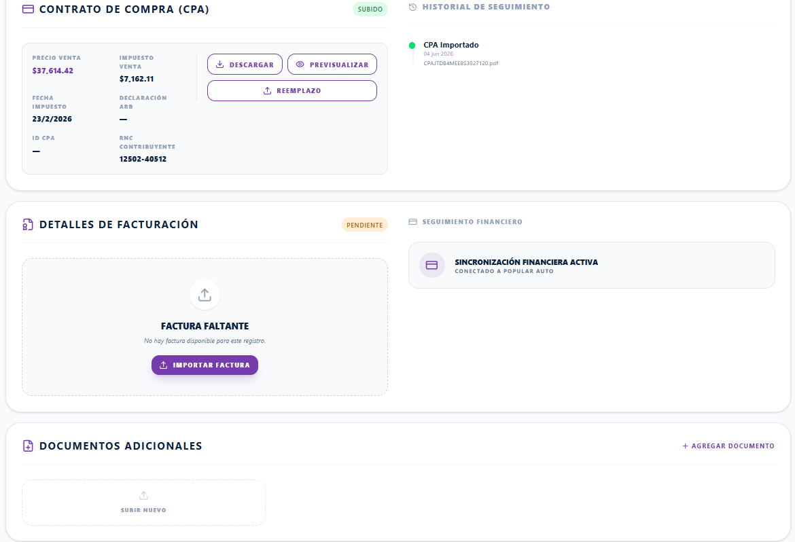
- **Notas para TCs:** el banner "Cambios sin guardar" + el chip con el nombre del campo es la evidencia principal para TCs de edición — capturar screenshot de este banner como evidencia del campo modificado.

### Componente asociado: Modal "Añadir Documento"
- **Cómo se llega aquí:** "+ AGREGAR DOCUMENTO" en "Documentos Adicionales" (modo edición), o "Agregar documento adicional" desde el menú "..." de una fila del grid.
- **Elementos clave:**
  | Elemento | Tipo | Texto/label literal | Comportamiento |
  |---|---|---|---|
  | Título | texto | "Añadir Documento" | — |
  | Chip vehículo | info | "{VIN}" / "{Marca} {Modelo} {Año}" | ej. "JN8BT3BA1TW330333" / "Nissan ROGUE 2025" |
  | Label | texto | "CATEGORÍA DE DOCUMENTO *" | obligatorio |
  | Dropdown | select | "Seleccione una categoría..." | opciones: "Carta Explicativa Exento de Arbitrios", "Certificado de Pago de Arbitrios", "Factura", "Otro" |
  | Label | texto | "ARCHIVO *" | obligatorio |
  | Dropzone | input file | "Arrastre un archivo aquí o **seleccione uno**" / "Solo archivos PDF permitidos" | al seleccionar, muestra chip con nombre de archivo + ícono "X" para quitar |
  | Botón | secundario | "CANCELAR" | — |
  | Botón | primario morado | "AÑADIR DOCUMENTO" | deshabilitado (gris claro) hasta que categoría + archivo estén completos; habilitado (morado sólido) al completarse |
- **Estados:** vacío (sin categoría ni archivo) / con categoría seleccionada (dropdown abierto) / con archivo adjunto (botón habilitado).
- **Screenshot:** 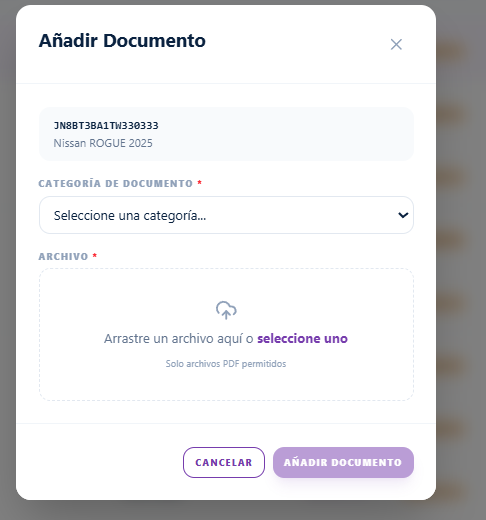 · 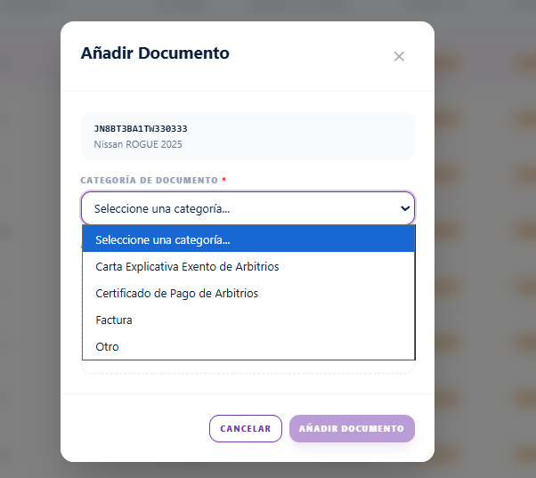 · 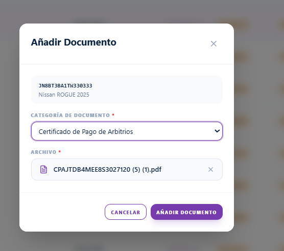
- **Notas para TCs:** la categoría "Certificado de Pago de Arbitrios" es el documento "CPA" — confirma la terminología usada en `/import/cpa`.
---

## Motorambar > Import > Importar CPA
- **Ruta/URL:** `/import/cpa`
- **Cómo se llega aquí:** botón "Acciones" → "Importar CPA" desde "Vehículos Importados" (`/import`).
- **Elementos clave:**
  | Elemento | Tipo | Texto/label literal | Comportamiento |
  |---|---|---|---|
  | Link volver | link | "← VOLVER A IMPORTADOS" | regresa a `/import` |
  | Stepper | stepper (3 pasos) | "SUBIR ARCHIVO" → "PROCESANDO VINS" → "RESUMEN" | paso 1 activo (morado) al entrar |
  | Título card | texto | "Importar CPA" | — |
  | Descripción | texto | "Sube el PDF de batch de Certificados de Pago de Arbitrios para procesamiento automático." | define el término "CPA" |
  | Dropzone | input file | "Arrastra y suelta tu PDF aquí" / "o **haz clic para seleccionar**" | — |
  | Botón | primario morado (claro/deshabilitado) | "Vincular VINs" | habilita tras subir un PDF |
- **Validación paso 1 (regla de negocio):** el PDF debe ser un **batch de múltiples páginas/VINs**. Si se sube un PDF de **una sola página**, el sistema muestra un mensaje de error indicando que para vehículos individuales se debe usar el grid de "Vehículos Importados" en lugar de este flujo. Si el PDF es válido (multi-página), avanza al paso 2.
- **Paso 2 "PROCESANDO VINS":** ejecuta en tiempo real un proceso en background (OCR) que la UI consulta por **polling** hasta completarse. _(Labels/UI exactos pendientes — falta screenshot real; existe skeleton `CpaProcessingSkeleton` en el código.)_
- **Paso 3 "RESUMEN":** pantalla de resumen del resultado del procesamiento. _(Labels/UI exactos pendientes — falta screenshot real; existe skeleton `CpaSummarySkeleton` en el código.)_
- **Estados:** documentado solo el paso 1 "SUBIR ARCHIVO" (vacío, sin archivo, y el caso de error por PDF de una sola página descrito arriba). Pasos "PROCESANDO VINS" y "RESUMEN" — pendiente screenshot real para confirmar labels exactos.
- **Screenshot:** 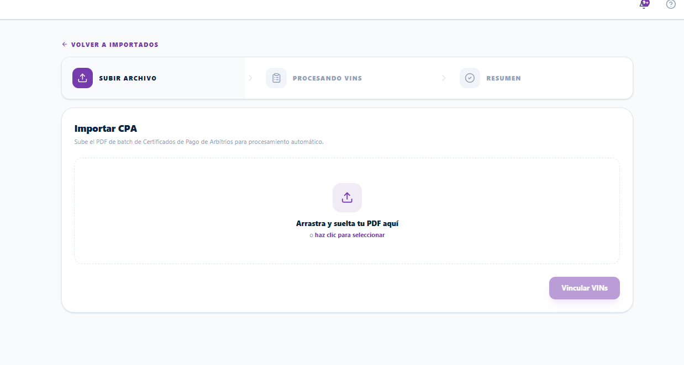
- **Notas para TCs:** "CPA" = Certificados de Pago de Arbitrios (definición oficial dada en esta pantalla). El comportamiento de validación (1 página → error / multi-página → avanza) fue confirmado por el usuario, pero los textos literales exactos de UI para pasos 2-3 no están confirmados — antes de escribir steps detallados para esos pasos, inspeccionar la app real vía MCP Browser o solicitar screenshot.
---

## Motorambar > Componentes Globales > Header (autenticado)
- **Ruta/URL:** presente en todas las rutas autenticadas (sidebar + topbar).
- **Cómo se llega aquí:** siempre visible tras login.
- **Elementos clave:**
  | Elemento | Tipo | Texto/label literal | Comportamiento |
  |---|---|---|---|
  | Ícono notificaciones | botón (campana + badge) | — | abre dropdown "NOTIFICACIONES" |
  | Ícono ayuda | botón | "?" | — |
  | Perfil | botón/dropdown | nombre usuario + badge rol + chevron | abre menú de perfil |
- **Estados:** —
- **Screenshot:** ver componentes asociados abajo.

### Componente: Dropdown "NOTIFICACIONES"
| Elemento | Tipo | Texto/label literal | Comportamiento |
|---|---|---|---|
| Header | texto | "NOTIFICACIONES" | — |
| Acción global | link morado | "Marcar todas" | + badge contador (ej. "40") |
| Item | notificación | "Factura procesada" (título morado) + hora (ej. "18:07") | descripción: "La factura {número} fue procesada el {fecha}" |
| Acción item | link | "Ver detalle" (ícono enlace externo) | — |
| Acción item | link | "Marcar leída" (ícono check) | — |
| Acción item | ícono rojo | basura | elimina la notificación |

Screenshot: 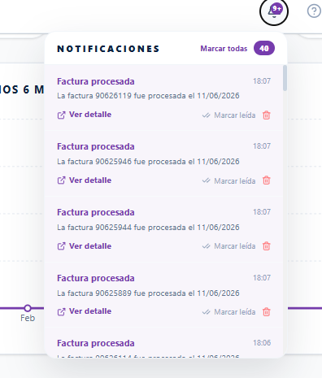

### Componente: Dropdown de perfil
| Elemento | Tipo | Texto/label literal | Comportamiento |
|---|---|---|---|
| Nombre | texto | "{Nombre Apellido}" (ej. "distri distri") | — |
| Username | texto gris | ej. "distri2" | — |
| Rol + empresa | info | ícono edificio + rol (ej. "DISTRIBUIDOR") + nombre empresa (ej. "Motorambar") | — |
| Opción | item | "Cambiar a Inglés" (ícono traducir) | toggle de idioma ES/EN |
| Opción | item rojo | "Cerrar sesión" (ícono logout) | cierra sesión |

Screenshot: 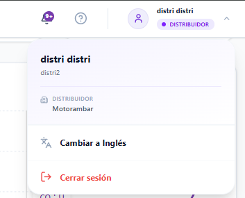

### Componente: Modal "Tu sesión está por cerrar" (timeout por inactividad)
| Elemento | Tipo | Texto/label literal | Comportamiento |
|---|---|---|---|
| Ícono | reloj naranja | — | — |
| Título | texto | "Tu sesión está por cerrar" | — |
| Cuerpo | texto | "Has estado inactivo. Tu sesión se cerrará en:" | seguido de contador en segundos (ej. "51s", naranja, grande) |
| Botón | secundario | "CANCELAR" | — |
| Botón | primario naranja | "CONTINUAR" | extiende la sesión |
| Cerrar | ícono "X" | — | — |

Screenshot: 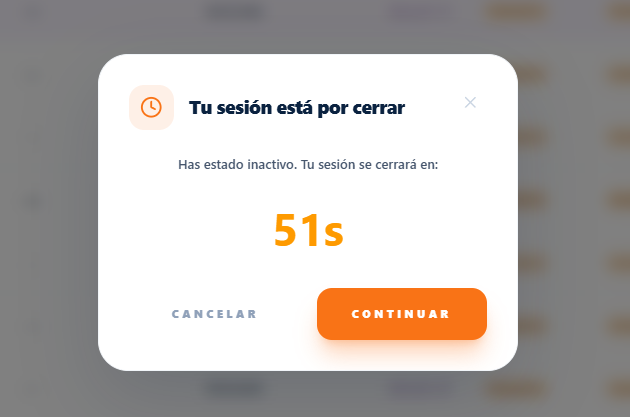

**Notas para TCs:** el contador regresivo es dinámico — para TCs de este modal, validar la presencia del modal y los botones, no un valor exacto de segundos.
---

## Motorambar > Admin > Usuarios (Gestionar Usuarios)
- **Ruta/URL:** _(pendiente confirmar — sección "Admin", rol Sys Admin)_
- **Cómo se llega aquí:** menú lateral (rol Sys Admin) → opción "Usuarios".
- **Elementos clave:**
  | Elemento | Tipo | Texto/label literal | Comportamiento |
  |---|---|---|---|
  | Ícono | botón ícono de "prohibido" (círculo con línea diagonal, por fila de usuario) | — | abre el modal "Revocar Token" para ese usuario |
- **Estados:** _(pendiente — falta screenshot completo de la lista de usuarios)_
- **Screenshot:** _(pendiente)_
- **Notas para TCs:** ver modal "Revocar Token" abajo — descripción literal confirmada por el usuario (sin captura adjunta aún).

### Componente: Modal "Revocar Token"
- **Cómo se llega aquí:** clic en el ícono de "prohibido" (círculo con línea diagonal) de un usuario en "Usuarios".
- **Elementos clave:**
  | Elemento | Tipo | Texto/label literal | Comportamiento |
  |---|---|---|---|
  | Cuerpo | texto | "¿Estás seguro de que deseas revocar el token de {Nombre}? El usuario deberá iniciar sesión nuevamente." | `{Nombre}` = nombre del usuario (ej. "distri distri" para `distri2`) |
  | Botón | secundario | "Cancelar" | cierra el modal sin realizar ninguna acción |
  | Botón | primario | "Revocar Token" | revoca el token de sesión del usuario; muestra toast "Token revocado exitosamente" |
  | Cerrar | ícono "X" | — | cierra el modal sin realizar ninguna acción (igual que "Cancelar") |
- **Estados:** —
- **Screenshot:** _(pendiente)_
- **Notas para TCs:** tras "Revocar Token", el usuario afectado queda desconectado en su siguiente interacción que requiera autenticación → pantalla de acceso bloqueado (`/sso-login`, ver "Login SSO (Autoreg)" en `CONTEXT.md`).
---
